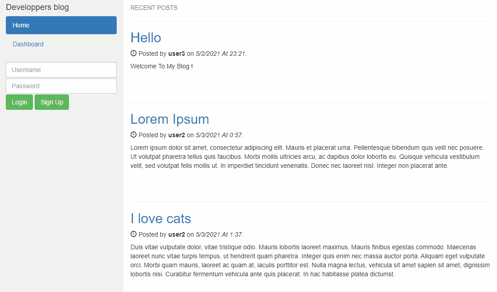

# Blog site
Homework for UC Berkeley Extension Coding Bootcamp



## Technologies Used
- Javascript - Backend coding
- Node - JavaScript runtime environment
- Express - Node Framework
- Mysql - Database managment system
- Handlebars - HTML Framework

## Summary 

This application allows you to create / Edit / Delete / Comment posts of your choice.
It requires to create an account for most of the actions.


## How to install
You would need to download the project on your local machine, install node.js then run the command :

```
node install
```

Update your Mysql infos in lib/mysql.js, then execute the db.sql in Mysql.

## How to use it
run the commande 

```
npm start then browse http://localhost:3001
```

## Snippet 
```js
setTimeout(function(){ $("#loginTxt").html("Auto Log-out in 1min."); }, 540000);
setTimeout(function(){ document.location.replace('/logout'); }, 600000);
```
This a very simple function that warns the user after 9min without any action. 
After 10min, the user will be looged out automatically.

## Live page
[Heroku link](https://blog-side-dc.herokuapp.com/)

## Author Links
[LinkedIn](https://www.linkedin.com/in/dcouzon/)
[GitHub](https://github.com/Dylancouzon)

